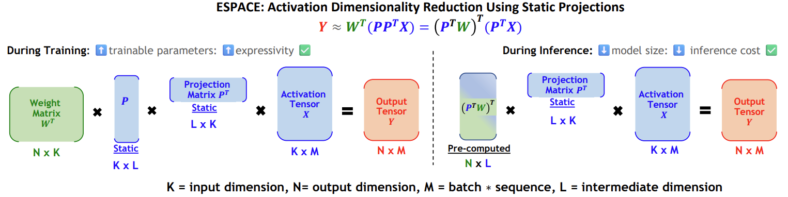

# ESPACE: Eigen Static Principal Activation Components Estimation

This repo contains the routines associated with the work that was published at NeurIPS 2024 called ESPACE: Dimensionality Reduction of Activations for Model Compression. The paper can be found [here](https://openreview.net/forum?id=HAcaANQNMK).



To use this ESPACE toolkit in your work, please add the `espace` directory to your python path.
## Repo Structure
This repository is split into three parts: generic, analysis, and projection.

### Generic
As its name suggests, the `generic` folder contains generic code which we use to interface between this toolkit and the application where it is running.

Here are the contents of this folder in order of importance:
- `generic/model_modifier.py`: The model modifier takes an input model and a list of arguments and makes surgial operations to relevant layers so that ESPACE is enabled. 
- `generic/arguments.py`: Populates the list of ESPACE arguments. These are passed to the above model modifier and dictate which layers to be modified, and how to use ESPACE, e.g., calibration, inference, training, etc...
- `generic/logger_handling.py`: Pipes out ESPACE logs to appropriate files. This is useful for debugging and making sure the program behaves as intended.
- `generic/name_checking_utils.py`: Helper file to corroborate which layer to work on based on arguments. Note that we always search for substrings with optional conjunctions, disjunctions, and negations.
- `generic/tp_merge_utils.py`: Only to be used when having calibrated projection matrices in a tensor parallel implementation and wanting to stack those in a way to implement 1-GPU inference.
- `generic/convert_to_numpy`: Useful if wanting to extract information to be plotted or visualized.

### Analysis
This is where the calibration occur. Specifically, this folder helps do two things: (1) it helps calibrating the autocorrelation matrices, and (2) it runs an eigenvalue decomposition on those in order to generate the projection matrices.

Here are the contents of this folder in order of importance:
- `analysis/statistics_estimator.py`: This class tracks autocorrelation matrices. To use, we suggest sending the relevant tensors in the forward through a `torch.nn.Identity()` and then enabling calibration by matching the name of the identity op using the generic arguments. Note that as discussed in the paper, there are three flavors to the calibration: `autocorrelation` which minimizes the mean squared error of activation decomposition, `scaled_autocorrelation` which minimizes the bound on GO-MSE, and `grad_autocorrelation` which minimizes the bound on NL-MSE. Additionally, for each L2 normalization may be enabled during tracking so that overall we have 6 calibrators as discussed in Section 3 of our paper.

- `analysis/projection_calculator.py`: This file contains routines to perform the hermitian eigenvalue decomposition on the calibrated matrices we found above. It does so by invoking the excellent CUPY tool. In addition it has checks on diagonalization and orthogonality of eigenvectors.

- `analysis/analysis_util.py`: Simple script to run the projection calculator.

- `analysis/correlation_unfifer.py`: Averages autocorrelation matrices in the context of tensor parallelism. This is only relevant to Column Parallel Linear whose inputs are shared among several GPUs. With this we ensure that each GPU uses the same projection matrix.

- `analysis/reconstruction_analyzer.py`: Monitor loss metrics when projection is used.


### Projection
This folder contains code to load projection matrices determined during calibration. By properly matching module names, users can appropriately reduce dimensionality of computation in their inference or training flows.

Here are the contents of this folder in order of importance:
- `projection/projection_module.py`: Classes that load calibrated projection matrices and provide options for dimensionality reductions. Note that users can pass their activations and weight through identity ops and replace those by projection modules. Doing so, in their application they will be able to reduce dimensionality of both which is useful during training (the left hand side of the above figure). Alternatively, they can choose to precompute weights and projections and only reduce dimensionality of activations; this would be useful at inference (right hand side of figure above).

- `projection/projection_mixer.py`: Helper file for selectively using the various calibrators. The choices would typically be done after a layer-wise sensitivity analysis (see Section 4 of our paper).

- `projection/convert_projections_to_bf16.py`: We used BF16 in our experiments, and this is indeed the recommended precision to use here. We welcome research from the community on extending our work to lower precision, e.g., 8b or 4b.

## Reference
If you have found this work useful, please consider citing our NeurIPS 2024 paper.
```
@inproceedings{sakrespace,
  title={{ESPACE}: Dimensionality Reduction of Activations for Model Compression},
  author={Sakr, Charbel and Khailany, Brucek},
  booktitle={The Thirty-eighth Annual Conference on Neural Information Processing Systems}
}
```
